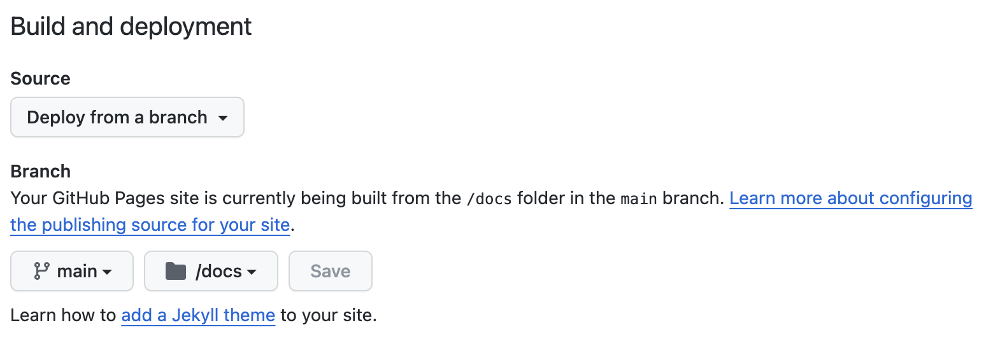

## Example shinylive app

1. Create an app (here I started from the example app from https://shinylive.io/r/examples/#hello-shiny). Save it to (e.g.) `code/app.R`.
2. Install `shinylive` and `httpuv`:
```
BiocManager::install("posit-dev/r-shinylive")
BiocManager::install("rstudio/httpuv")
```
3. Export the app to a directory that can then be served using `httpuv`:
```
shinylive::export(appdir = "code", destdir = "docs")
```
4. Test locally: 
```
httpuv::runStaticServer("docs")
```
5. Push (at least) the `docs` folder to GitHub.
6. Set up GitHub Pages in the GitHub repository to serve the `docs` folder from the `main` branch. 

7. Navigate to the GitHub Pages website to use the app. 

### Resources

- [https://github.com/RamiKrispin/shinylive-r](https://github.com/RamiKrispin/shinylive-r)
- [https://github.com/posit-dev/shinylive](https://github.com/posit-dev/shinylive)
- [https://shinylive.io/r/examples/#hello-shiny](https://shinylive.io/r/examples/#hello-shiny)
